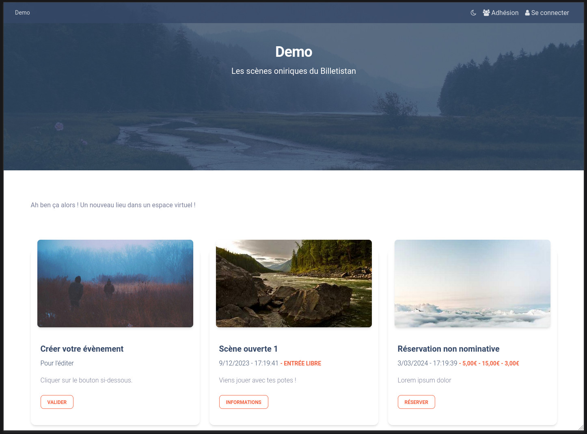

# TiBillet - Federated tools for cooperative networks

> [!NOTE]  
> TLDR; A suite of free applications for managing your social and solidarity venue : Cash register, membership,
> ticketing,
> cashless, time currency, order taking and room management.
> The current git repository is one of the building blocks of the TiBillet ecosystem: Lespass.
> 
> https://tibillet.org

### EN : Introduction

TiBillet is a FLOSS solution for payment, associative membership, online booking and ticketing, time and local currency
management, festival cashless and order management for refreshment stands and catering facilities.

The general idea is to broaden the scope of a membership and/or cashless card already in circulation at many venues and
festivals, to create a cooperative network.

The platform aims to encourage the circulation of audiences and cooperation between the various players in an area, such
as third-party venues, associations, festivals, artists, craftsmen and open-source software developers.

Users have access to an NFC card valid throughout the TiBillet network, with no subscription or top-up fees, enabling
them to manage and associate memberships, subscriptions, time currencies, local and/or free and federated to several
venues.

Last but not least, TiBillet is an open-source software package developed by Code Commun
Cooperative (https://codecommun.coop).

When you use TiBillet, you become part of a social economy network that supports you from A to Z.

TiBillet is made by the Code Commun Cooperative

### FR : Introduction

Réseau événementiel et coopératif.

TiBillet est un ensemble d'outils libres qui comprend une caisse enregistreuse, un système de paiement sans contact Zéro
Espèce ( Cashless ), de gestion d'évènements, de gestion de salles
de restauration, d'adhésion et d'engagement associatif, de boutique et de reservation en ligne … mais pas uniquement !

C'est aussi un outil de mise en réseau et de gestion d'une carte cashless locale et commune à plusieurs lieux.

L’idée de TiBillet est de se réapproprier des outils qui n’existent tout simplement pas en libre, et de les mutualiser
pour en faire un réseau de musiciens, de lieux et pourquoi pas une monnaie locale dédiée, à la culture, aux
associations, aux tiers-lieux, etc...

La richesse de TiBillet, c’est de chercher à créer des zones d’échange, de créer une économie circulaire, sociale et
solidaire, décentralisée et non spéculative à l'échelle d'un territoire.

TiBillet est en période de BETA et en expérimentation sur plusieurs lieux sur l'ile de la Réunion. Venez nous voir au
Bisik, à la Raffinerie, et au Manapany Festival !

# TiBillet / Lespass

The current git repository is one of the building blocks of the TiBillet ecosystem: Lespass
It contains the ticketing, membership and landing page engines.

The engines are :

- [Lespass](https://github.com/TiBillet/Lespass): ticketing, membership and landing page engines.

- [LaBoutik](https://github.com/TiBillet/LaBoutik): Cash register, cashless system with RFID / NFC chip and order-taking system.

- [Fedow](https://github.com/TiBillet/Fedow) : Federated and open wallet, the federation engine. A blockchain to share membership assets, local currencies and
  time for several Lespass and LaBoutik instances.

### Documentation :

EN : [https://tibillet.org]
FR : [https://tibillet.org/fr]

## Made by, with and for :

- [Coopérative Code Commun](https://codecommun.coop)
- [la Réunion des Tiers-lieux](https://www.communecter.org/costum/co/index/slug/LaReunionDesTiersLieux/#welcome)
- [La Raffinerie](https://www.laraffinerie.re/)
- [Communecter](https://www.communecter.org/)
- Le Manapany Festival
- Le Demeter

## THANKS & SPONSORS

- [JetBrain](https://jb.gg/OpenSourceSupport)

## Contact :

- [Discord](https://discord.gg/ecb5jtP7vY)
- [Rocket Chat Tiers Lieux.org](https://chat.tiers-lieux.org/channel/TiBillet)
- [Rocket Chat Communecter](https://chat.communecter.org/channel/Tibillet)
- [e-mail](mailto:contact@tibillet.re)
