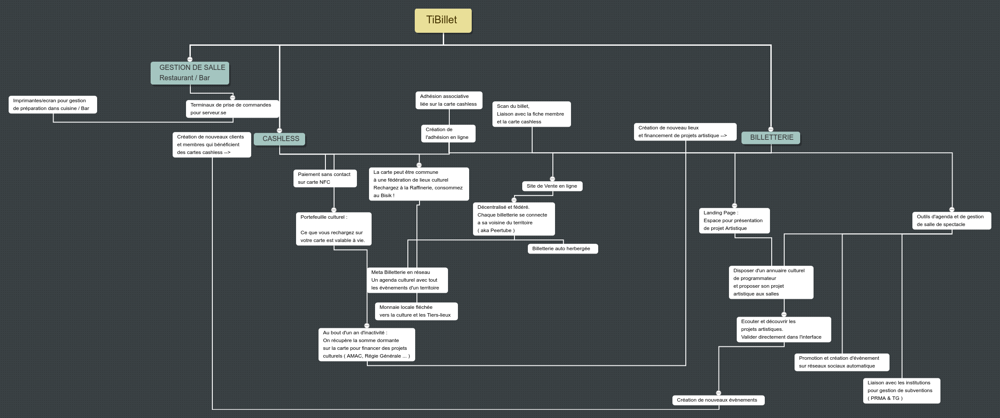
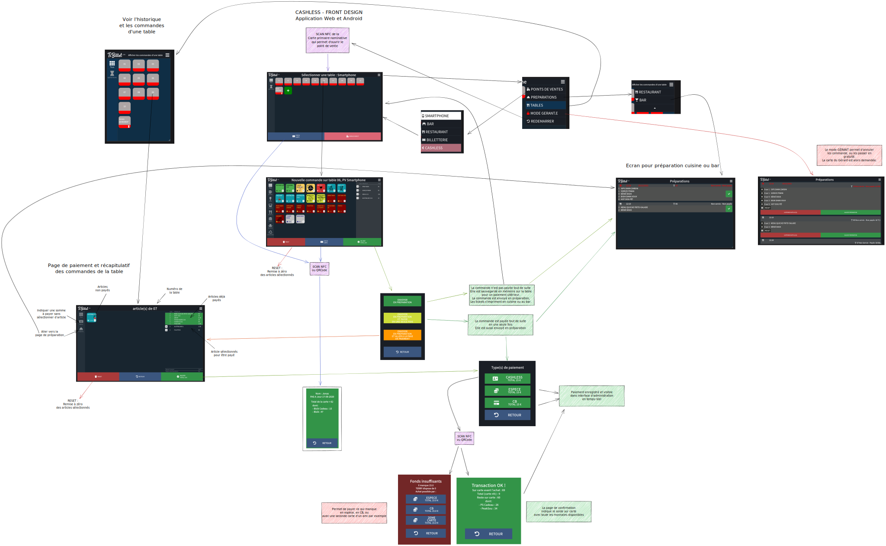

# ACTIVE BETA NOT READY FOR PRODUCTION YET

## Nous cherchons activement toute forme d'aide pour construire TiBillet ! N'hésitez pas à nous contacter :)

# TiBillet

Réseau événementiel et coopératif.

TiBillet est un système de paiement sans contact Zéro Espèce ( Cashless ), de gestion d'évènements, de gestion de salles
de restauration, d'engagement associatif et d'achat de billets en ligne … mais pas uniquement !

C'est aussi un outil de mise en réseau et de gestion d'une monnaie locale et commune à plusieurs lieux.

TiBillet permet la création d'une économie circulaire, sociale et solidaire à l'échelle d'un territoire.

Pour en savoir plus : https://www.tibillet.re & https://wiki.tibillet.re

## Mindmap VF



## Ticketing frontend design.

Open [Front Billetterie.excalidraw](https://github.com/TiBillet/TiBillet/blob/main/Presentation/Front%20Billetterie.excalidraw) on https://excalidraw.com/


## Cashless frontend design.

Open [Front Cashless.excalidraw](https://github.com/TiBillet/TiBillet/blob/main/Presentation/Front%20Cashless.excalidraw) on https://excalidraw.com/




### Démonstration :

https://demo.tibillet.re
- login : adminou
- password : miaoumiaou

Une fois sur la page d'administration, aller sur "Voir le site" pour découvrir l'interface cashless.
Ou aller sur : 
https://demo.tibillet.re/wv/


## Introduction.

TiBillet est en période de BETA et en expérimentation sur plusieurs lieux sur l'ile de la Réunion. Venez nous voir au
Bisik, à la Raffinerie, et au Manapany Festival !

Le présent dépot ne contient pas encore toutes les sources du projet en cours d'expérimentation : 
La billetterie est en cours de publication.
Le Cashless est en cours d'audit de sécurité et sera publié sous licence libre ASAP.

Mais ceci dit, si vous souhaitez l'expérimenter chez vous, n'hésitez pas à nous contacter. Toute aide et retour d'expérience sont les bienvenus.

TiBillet est originalement construit par l'association des 3Peaks de Manapany : Créateurs du Manapany Surf Festival.
Une société coopérative ( SCIC ) est en création pour porter juridiquement une fédération autour des acteurs de la solution :
Developpeurs, utilisateurs, organisateurs, tiers-lieux et collectivités locales seront réunis autour d'une coopérative
d'interet commun.

Venez discuter avec nous :
- Discord : https://discord.gg/7FJvtYx


## Installation :

### Dependency
- Traefik. 
Example here :
https://github.com/TiBillet/Traefik-reverse-proxy

- Docker & docker-compose
See https://docs.docker.com/ for installation.


```shell
cd Docker/Development
# Copy the example environement file 
cp env_example .env
# populate .env file with your own variables.
nano .env
# build docker image
docker-compose build
# launch 
docker-compose up
```

## First time launch

```shell

# Go deeper inside the django container :
docker exec -ti billetterie_django bash

# --> Inside the container :
  # apply the db migration ( tables creations )
  python manage.py migrate
  
  # Populate the database with the public tenant ( the first one : www. )
  python manage.py create_public
  
  # Create the root user on the "public" tenant
  # Use VERY STRONG PASSWORD AND DON'T USE THE SAME EMAIL as .env !
  python manage.py create_tenant_superuser
    ? -> public
```

## POP demo data, for dev' or just take a look :)

```shell
# Run the server :
  python /DjangoFiles/manage.py runserver_plus 0.0.0.0:8002
# or
  rsp
  
# Pop data inside the TiBillet-Ticket/DjangoFiles/data/domains_and_cards.py
# Change the file if you want !
# --> With a second shell inside the container :
	python manage.py pop_demo_data

Test with ```www.$DOMAIN/admin``` and ```raffinerie.$DOMAIN/admin```
```

if you are in localhost, change your /etc/host in order to simulate a real adress for the request :
172.17.0.1
I use djang-local.org as $DOMAIN. Use yours !

```
#example /etc/hosts
172.17.0.1       django-local.org
172.17.0.1       www.django-local.org
172.17.0.1       raffinerie.django-local.org
```

# BACKEND API Documentation

### API Postman with example :

https://documenter.getpostman.com/view/17519122/UVeDtTFC

# FRONTEND

Le frontend basé sur le framework Vue.js est en cours de développement. N'hésitez pas à nous contacter pour contribuer.

# Licence :

TiBillet is ( for the moment ) under the Server Side Public Licence ( SSPL ), an AGPL like licence :

https://www.mongodb.com/licensing/server-side-public-license

https://webassets.mongodb.com/_com_assets/legal/SSPL-compared-to-AGPL.pdf

# Crédits and développement :
[AUTHORS.md](https://github.com/TiBillet/TiBillet/blob/main/AUTHORS.md)

