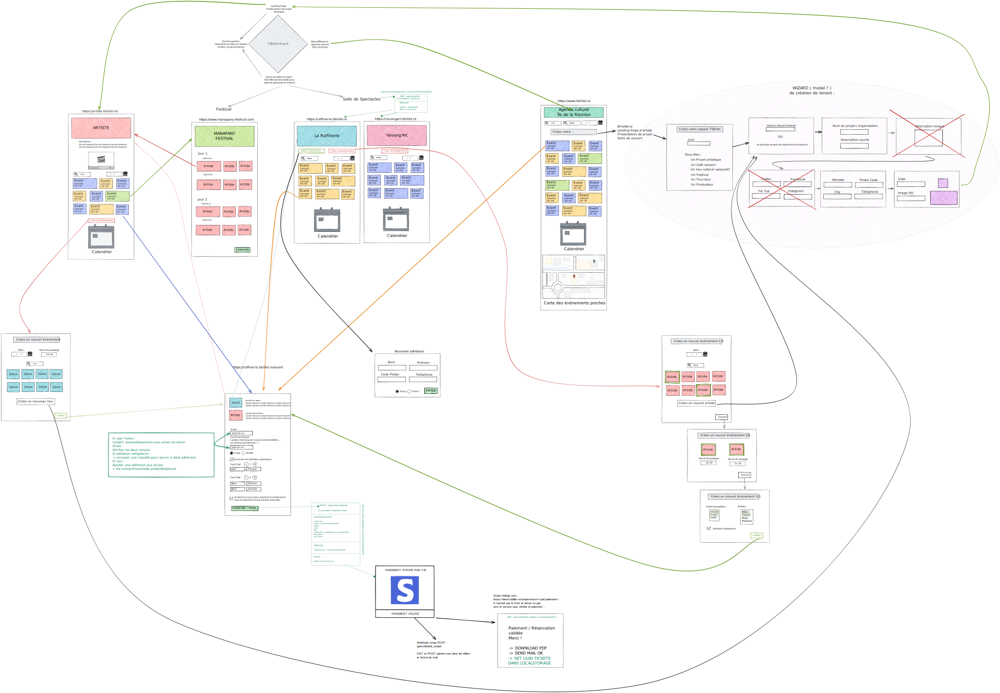

######  ##############

# ACTIVE BETA NOT READY FOR PRODUCTION YET

## Nous cherchons activement toute forme d'aide pour construire TiBillet ! N'hésitez pas à nous contacter :)

######  ##############

# TiBillet

Réseau événementiel et coopératif.

TiBillet est un système de paiement sans contact Zéro Espèce ( Cashless ), de gestion d'évènements, de gestion de salles
de restauration, d'engagement associatif et d'achat de billets en ligne … mais pas uniquement !

C'est aussi un outil de mise en réseau et de gestion d'une monnaie locale et commune à plusieurs lieux.

TiBillet permet la création d'une économie circulaire, sociale et solidaire à l'échelle d'un territoire.

Pour en savoir plus : https://www.tibillet.re & https://wiki.tibillet.re

## Ticketing Design.



## Cashless Design.

Soon. Need help :)

## Introduction.

TiBillet est en période de BETA et en expérimentation sur plusieurs lieux sur l'ile de la Réunion. Venez nous voir au
Bisik, à la Raffinerie, et au Manapany Festival !

Le présent dépot ne contient pas encore toutes les sources du projet. La billetterie est en cours de refactoring et les
sources sont publiées petit à petit sous licence libre.

Le Cashless est en cours d'audit de sécurité et sera publié sous licence libre dès que possible. On a encore pas mal de
boulot avant :)

Mais ceci dit, si vous souhaitez l'expérimenter chez vous, n'hésitez pas à nous contacter :)

TiBillet est originalement construit par l'association des 3Peaks de Manapany : Créateurs du Manapany Surf Festival.
Nous sommes en cours de création d'un SCIC pour porter juridiquement une fédération autour des acteurs de la solution :
Developpeurs, utilisateurs, organisateurs, tiers-lieux et collectivités locales seront réunis autour d'une coopérative
d'interet commun.

## Installation :

We need Docker & docker-compose. See https://docs.docker.com/ for installation.

```shell
cd Docker/Development
# populate .env file with your own variables and copy it.
cp env_example .env
# build docker image
docker-compose build
# launch 
docker-compose up -d
```

## First time launch

```shell

# Go deeper inside the django container :
docker exec -ti billetterie_django bash

# --> Inside the container :
  # apply the db migration ( tables creations )
  python manage.py migrate
  
  # Populate the database with the public tenant ( the first one : www. )
  python manage.py create_public
  
  # Create the root user
  # Use VERY STRONG PASSWORD AND DON'T USE THE SAME EMAIL as .env !
  python manage.py create_tenant_superuser
    ? -> public
```

## POP demo data, for dev' or just take a look :)

```shell
# Run the server :
  python /DjangoFiles/manage.py runserver_plus 0.0.0.0:8002
# or
  rsp
  
  
# Pop data inside the TiBillet-Ticket/DjangoFiles/data/domains_and_cards.py
# Change the file if you want !
# --> Open a seconde shell inside the container :
	python manage.py pop_demo_data


Test with ```www.$DOMAIN:8002/admin``` and ```demo.$DOMAIN:8002/admin```
```

Don't forget to change your /etc/host if you are in localhost :)
172.17.0.1 is the docker host network.

```
#example /etc/hosts
172.17.0.1       django-local.org
172.17.0.1       www.django-local.org
172.17.0.1       demo.django-local.org
172.17.0.1       m.django-local.org
172.17.0.1       bisik.django-local.org
172.17.0.1       raffinerie.django-local.org
172.17.0.1       vavangart.django-local.org
172.17.0.1       3peaks.django-local.org
172.17.0.1       manap.django-local.org


# go to demo.django-local.org:8002/admin to create an admin user for the tenant. 
```

# BACKEND API Documentation

### API Postman with example :

https://documenter.getpostman.com/view/17519122/UVeDtTFC

# FRONTEND

Le frontend basé sur le framework Vue.js est en cours de développement. N'hésitez pas à nous contacter pour contribuer.

# Licence :

TiBillet is ( for the moment ) under the Server Side Public Licence ( SSPL ), the anti-amazon GPL like licence.

https://www.mongodb.com/licensing/server-side-public-license

https://webassets.mongodb.com/_com_assets/legal/SSPL-compared-to-AGPL.pdf

# Crédits and développement within the AUTHORS.md file
